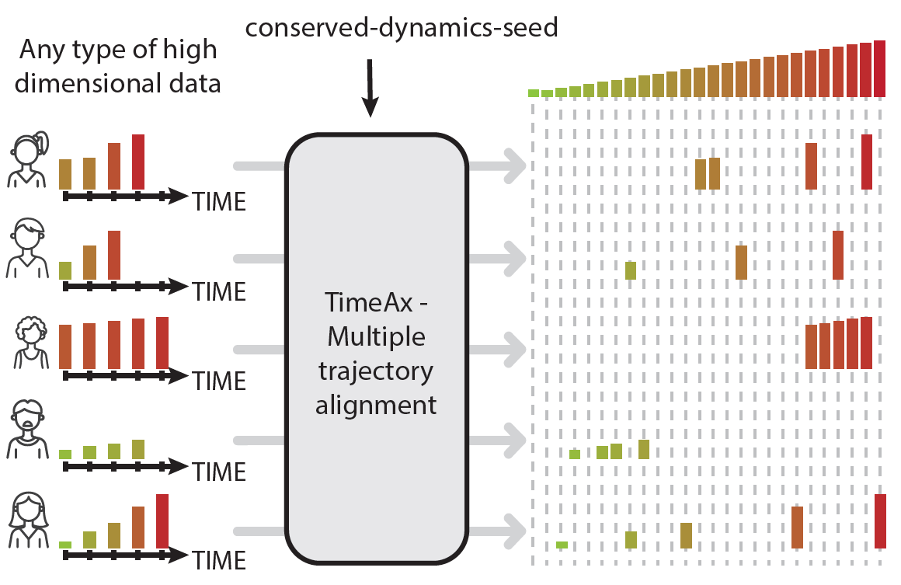
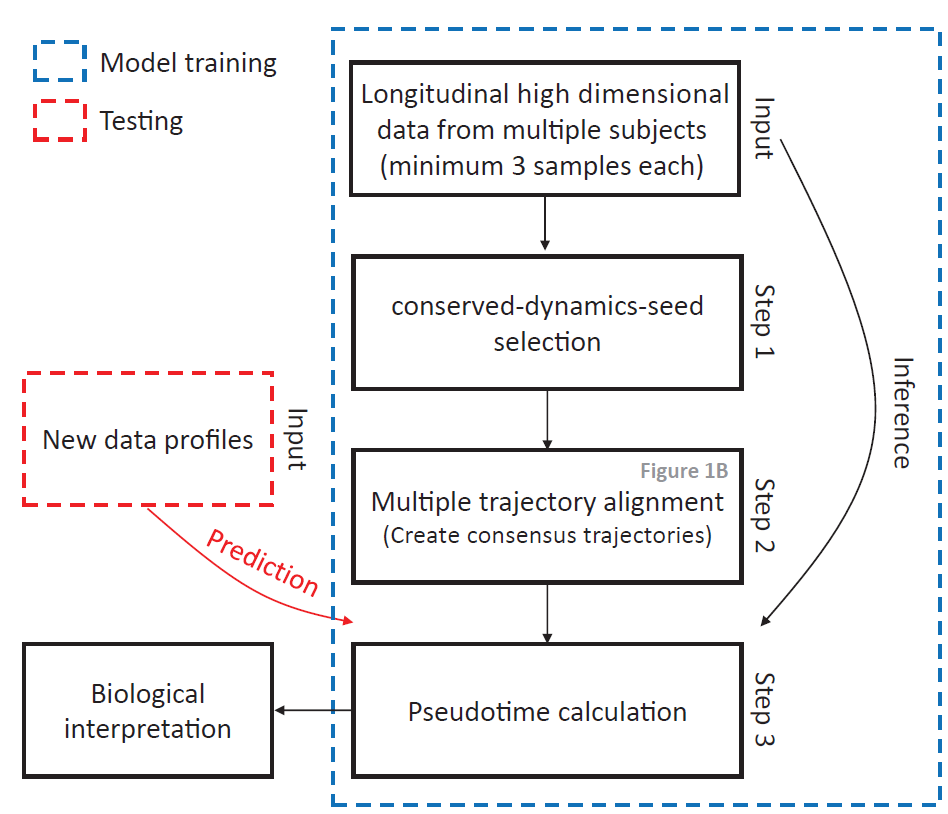

Patient cohorts tend to display high heterogeneity in patients’ disease courses, masking shared disease progression dynamics and the underlying biological mechanisms that are shared across all patients. Often, the naive solution is clustering patients into disease-specific, clinical stages or subtypes, which often fails to capture the continuous dynamics of the disease and its progression over time. To overcome this problem, TimeAx quantitatively models a representation of the shared disease dynamics over time. TimeAx relies solely on measured features (i.e, genes, clinical markers, etc.) collected longitudinally from multiple patients (3 or more time points per patient). Importantly, patient time points can differ in number and in collection time.



## TimeAx pipeline
The TimeAx pipeline is combined of two simple steps, which require only a longitudinal feature matrix and the patient identifiers withn the matrix. First, a training step where longitudinal data is used to construct a model containing the consensus trajectory of the disease dynamics. Second, the model can be used to estimate disease pseudotime postions for patients' samples (using either cross-sectional or longitudinal data).


## TimeAx package installation and code requirements
TimeAx package can be downloaded from github. Please make sure you have the devtools package installed prior to TimeAx installation. TimeAx installation should take few minutes depending how many of the dependent packages are already installed. 

```R
library(devtools)
install_github("amitfrish/TimeAx")
```

<br /><br />
## Step 1+2: training a TimeAx model (seed selection + multiple trajectory analysis)
The user should first train a TimeAx model based on a any kind of logitudinal data of the biological process, with at least 3 samples in each individual trajectory. The modeling will run automatically two internal steps: seed selection and multiple trajectory analysis based on the selected seed. If the user has its own seed, this can be included and will override the seed selection step. The model will be later used to infer the pseudotime positions of each sample. This step should take few minutes depending how the size of the train cohort.

```R
library(TimeAx)
data(UBCData)
model = modelCreation(DataUBC,UBCSamples)
```

### Mandatory inputs
#### trainData: 
A matrix containing profiles (columns) of omics measurments (rows) from multiple individuals and different time points. For omics data it is better to use raw values instead of normalized ones. Profiles for each individual should be ordered by chronological time.
#### sampleNames 
A vector containing the individual identity of each sample in the trainData.

### Optional inputs
#### ratio 
A boolean parameter determining whether the model should be based on feature ratios or the base features. The default is TRUE.
#### numOfIter: 
Number of consensus trajectories. The default is 100.
#### numOfTopFeatures: 
Length of the conserved-dynamics-seed of features. The default is 50.
#### seed
The conserved-dynamics-seed. If provided, the alignment process will be conducted based on these features. The default is NULL.
#### no_cores:
A number for the amount of cores which will be used for the analysis. The defalt (NULL) is total number of cores minus 1.

<br /><br />
## Step 3: Inferring pseudotime
Based on the TimeAx model, the user can infer the pseudotime position of each sample, assuming its profile includes the same features as the train data. The output of this step is a list containing the pseudotime positions of each sample (predictions) and it's equivilant uncertainty score (uncertainty). This step is relatively quick and should take seconds to few minutes depending how the size of the test cohort.

```R

library(TimeAx)
data(UBCData)

pseudotimeStats = predictByConsensus(model,DataUBC)
pseudotime = pseudotimeStats$predictions
uncertainty = pseudotimeStats$uncertainty

```
### Mandatory inputs
#### model:
A TimeAx model.
#### testData: 
A matrix containing profiles (columns) of features measurments (rows). Data should provided in similar scales (preferably, non-normalized) as the train data. Seed genes that are missing in the test data will be excluded from the prediction.


### Optional inputs
#### no_cores:
A number for the amount of cores which will be used for the analysis. The defalt (NULL) is total number of cores minus 1.
#### seed
The conserved-dynamics-seed. If provided, the prediction process will be conducted based on these features. Use the model's seed by keeping the the default value of NULL.
#### sampleNames 
Used for the robustness analysis. Always keep as NULL.

<br /><br />
## Model testing (not mandatory): Robustness analysis
Calculates a robustness score for the TimeAx model. High robustness score implies that the model indeed captures a biological process that changes over time. On the other hand, a low robustness score suggests that the model fails to represent a continuous process over time. The output of this step is a list containing the robustness pseudotime positions of each sample (robustnessPseudo) and the robustness score for the model (score).

```R

library(TimeAx)
data(UBCData)

robustnessStats = robustness(model,DataUBC,UBCSamples)
robustnessPseudo = robustnessStats$robustnessPseudo
robustnessScore = robustnessStats$score

```

### Mandatory inputs
#### model:
A TimeAx model.
#### trainData: 
The matrix containing profiles (columns) of omics measurments (rows), which was used to train the model.
#### sampleNames 
A vector containing the individual identity of each sample in the GEData. Same vector as used in the training.


### Optional inputs
#### pseudo
The output list of predictByConsensus. If not provided (NULL), pseudotime will be inferred by this function.
#### no_cores:
A number for the amount of cores which will be used for the analysis. The defalt (NULL) is total number of cores minus 1.


